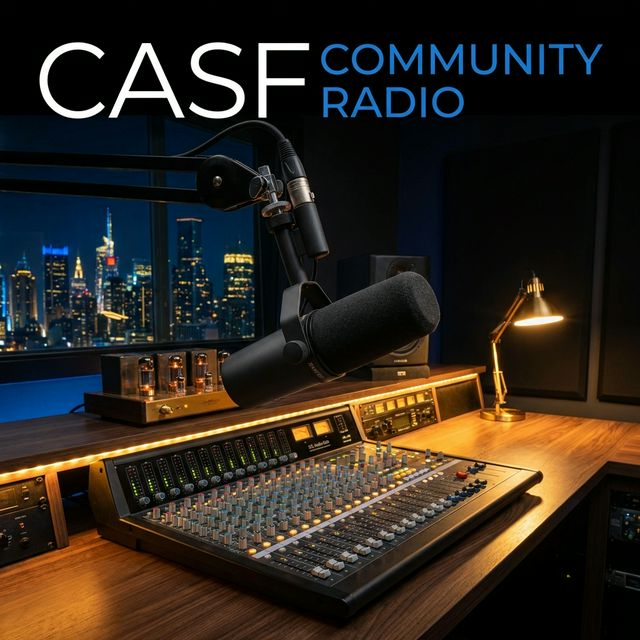
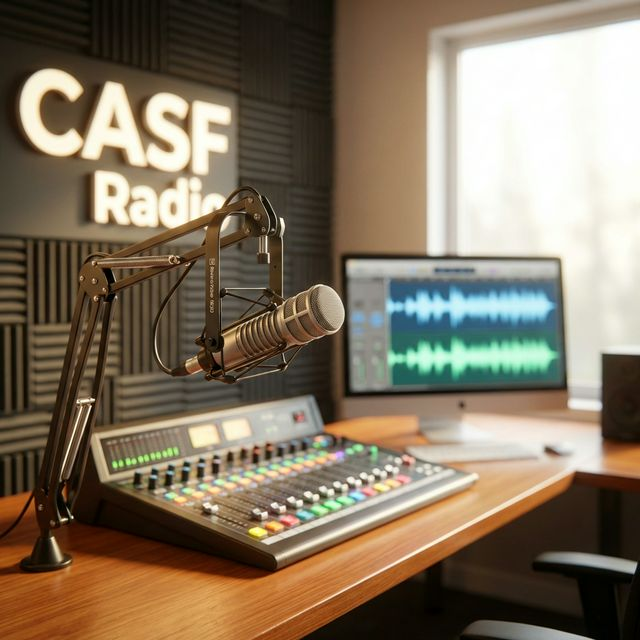
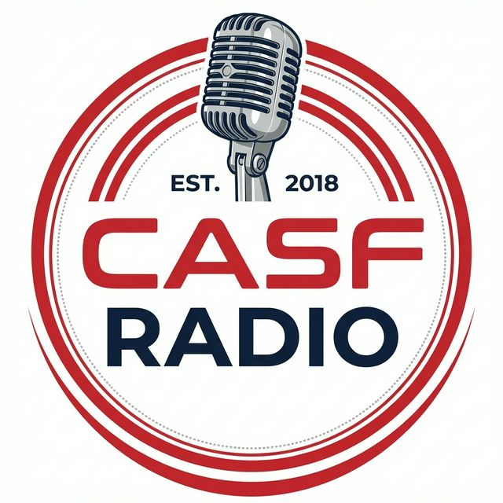

  

<h1 align="center">CASF Community Radio</h1>

  <strong>The Digital Pulse of the Central Valley</strong>

  
  
  
  
  

---

## ✨ Overview

CASF Community Radio is a state-of-the-art digital broadcasting platform tailored for the unique voice of the Central Valley. Built with a focus on human connection and community engagement, it offers a seamless blend of live audio, local news, and specialized programming.

## 🚀 Key Features

| Feature | Description |
| :--- | :--- |
| **📻 Live Streaming** | High-fidelity persistent audio player with real-time track metadata. |
| **🖼️ Auto-Artwork** | Dynamic album art fetching from global music databases. |
| **📰 News Hub** | Community-focused news management with rich-text capabilities. |
| **📅 Smart Schedule** | Automated 24/7 program rotations and "Up Next" notifications. |
| **🔒 Admin Suite** | Secure, full-featured dashboard for content and message management. |
| **📊 Analytics** | Real-time listener tracking and engagement insights. |

## 🛠️ Technology Stack

- **Framework**: [Next.js 15](https://nextjs.org/) (App Router)
- **Styling**: [Tailwind CSS](https://tailwindcss.com/)
- **Auth**: [NextAuth.js](https://next-auth.js.org/)
- **State**: React Hooks (Strict Mode)
- **Icons**: [Lucide React](https://lucide.dev/)
- **Deployment**: Optimized for Vercel/Node.js

## � Media Preview

  
  

## 🔐 Administration

The platform includes a robust administrative backend for station owners:

1.  **Content Management**: Intuitive editors for news, shows, and schedules.
2.  **Listener Feedback**: Integrated message center for requests and inquiries.
3.  **System Health**: Monitoring tools for stream status and analytics.

---

  Built with ❤️ for the Central Valley community.

